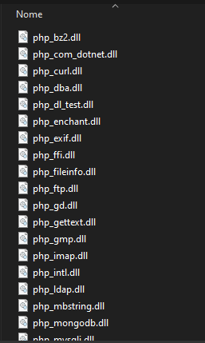
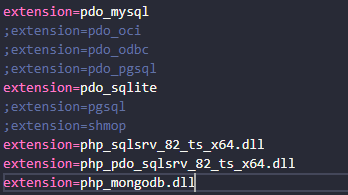
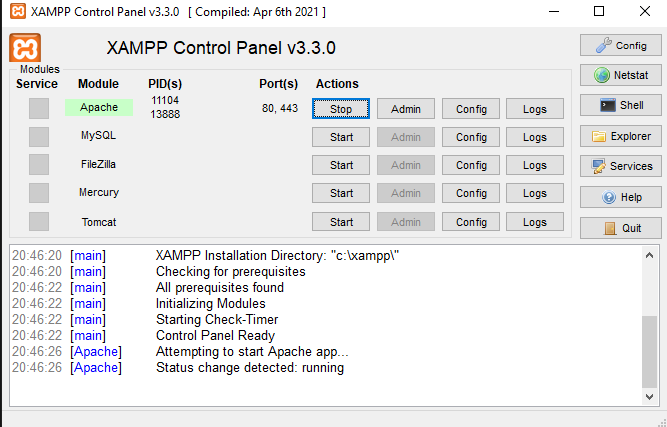

# Documentação Técnica Back end

## Arquitetura e Stack

Este projeto está organizado usando conceitos da arquitetura limpa e solid. Para mais detalhes, acesso o Desenho da arquitetura do projeto.

Datalhes da stack:

- A implementação é feita usando [PHP](https://nodejs.org/en). Recomenda-se o uso de abstrações de instalação, como o [xampp](https://www.apachefriends.org/pt_br/index.html)
- Uso do Framework [Laravel](https://laravel.com/)
- Persistência de dados é feita em um banco [MongoDB](https://www.mongodb.com/pt-br). Além disso, é requirido o uso da [extensão](https://github.com/mongodb/mongo-php-driver/releases/download/1.16.0/php_mongodb-1.16.0-8.2-ts-x64.zip) do mongoDB para o php.
- As bibliotecas usadas no projeto podem ser vistas no arquivo de [dependências](https://github.com/Devzando/portal-egressos-back/blob/main/composer.json) na raiz do projeto
- O gerenciador de pacotes usado no projeto foi o [Composer](https://getcomposer.org/)

## Execução do código

Primeiramente, vamos colocar a extensão do php citada no tópico anterior no diretório onde se encotra as extensões do php:

Após extrair o arquivo de extensão, copie o arquivo php_mongodb.dll para o diretório das extensões php. No meu caso, se encontra em **C:\xampp\php\ext**



Feito o passo anterior, altere o arquivo php.ini e coloque na parte de extensões o seguinte trecho: **extension=php_mongodb.dll**. No meu caso, o diretório onde está esse arquivo se encontra em **c:\xampp\php**



Ligue o servidor apache ou outro que seja da sua escolha.



Com o php configurado para rodar o mongodb, devemos instalar as dependências do projeto. Certifique-se que você tenha o composer instalado em sua maquina e configurado nas variáveis do sistema:

```bash
composer install
```

Após dependências instaladas, crie um arquico .env na raiz do projeto e insira as variáveis de ambiente no arquivo:

```tsx
APP_NAME=Laravel
APP_ENV=local
APP_KEY=
APP_DEBUG=true
APP_URL=http://localhost

LOG_CHANNEL=stack
LOG_DEPRECATIONS_CHANNEL=null
LOG_LEVEL=debug

DB_URI=
```

Variáveis de ambiente configuradas, rode o seguinte comando:

```bash
php artisan serve
```

## Teste e validação:

Para ter acesso a documentação dos endpoints, em um navegador acesse:

- http://localhost:8000/api/docs